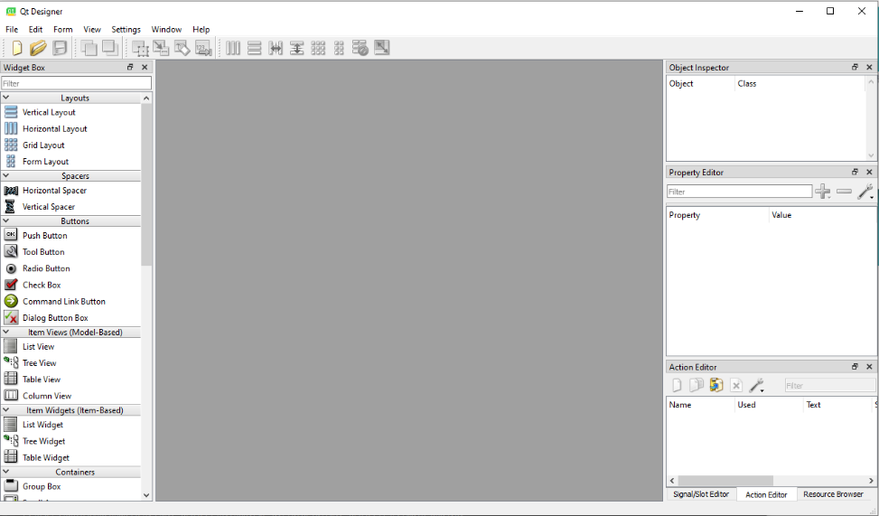
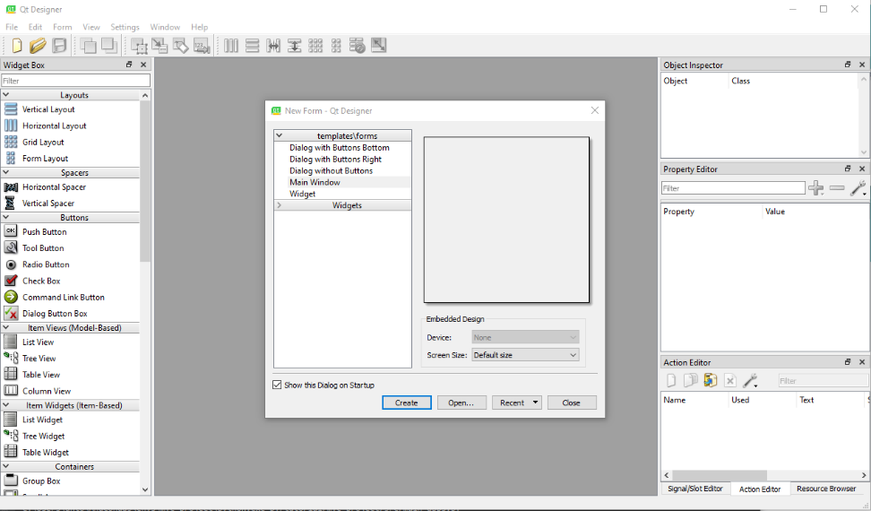
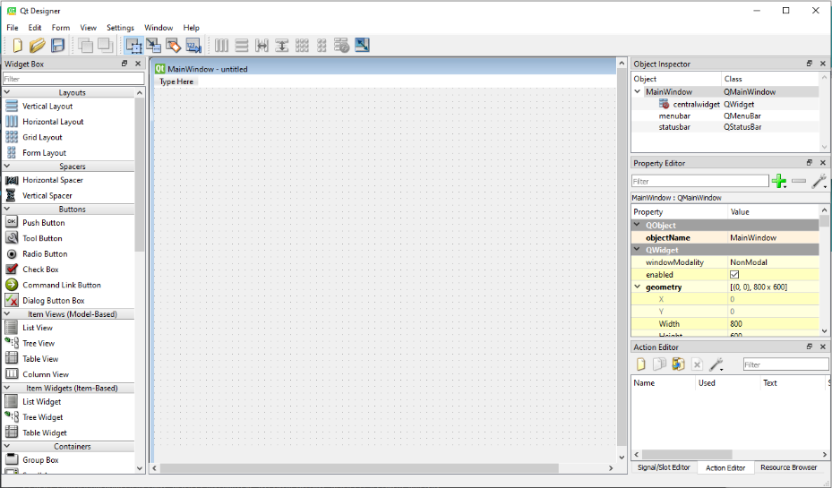
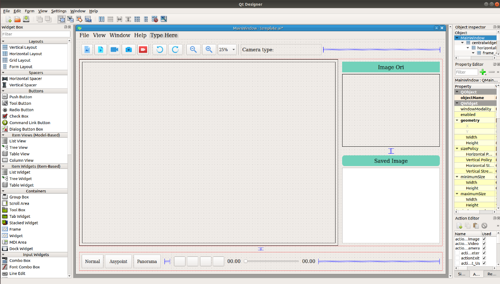
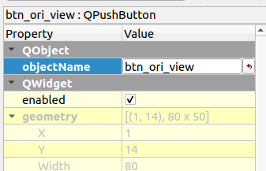
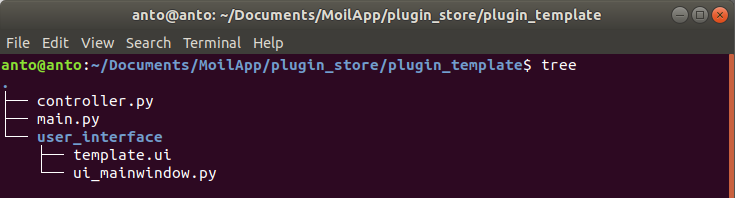
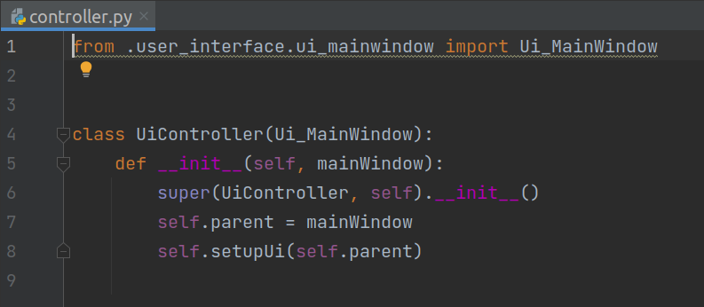
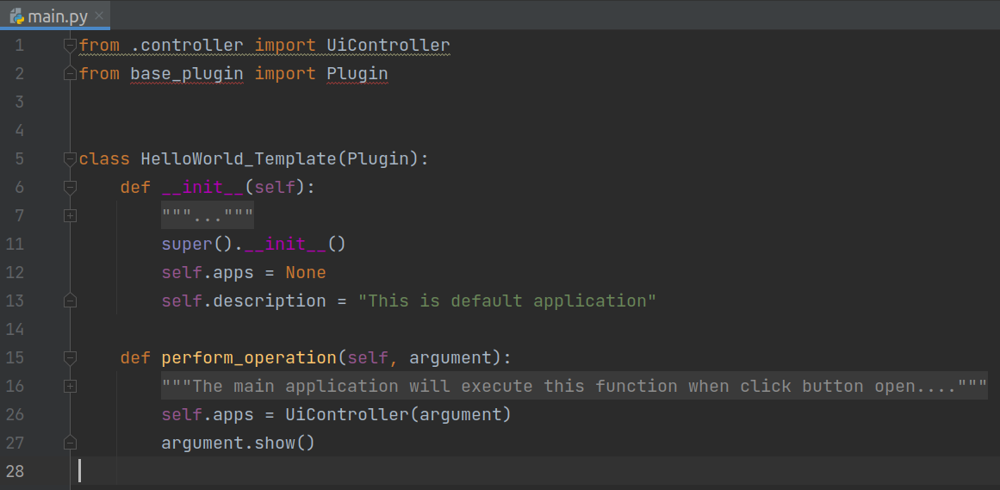

Create your own plugins Application
###################################

6.1 Support function
====================

The following is a function that can be used in your plugin application:

a. Moilutils
------------

.. raw:: html

   

    MoilApp provides several functions that can be used as a support in making your own applications that we named “moilutils”. If you want to use moilutils function, you have to import it into your program like bellow this: 

.. code-block:: bash

    >> from moilutils import MoilUtils

.. raw:: html

       
        <table>
          <tr>
            <th style="width: 30%"></th>
            <th style="width: 40%"></th>
            <th style="width: 30%"></th>
          </tr>
          <tr>
            <td>selectFile()</td>
            <td>selectDirectory()</td>
            <td>readImage()</td>
          </tr>
          <tr>
            <td>resizeImage()</td>
            <td>rotateImage()</td>
            <td>saveImage()</td>
          </tr>
          <tr>
            <td>drawPoint()</td>
            <td>drawLine()</td>
            <td>calculateHeight()</td>
          </tr>
          <tr>
            <td>readCameraType()</td>
            <td>copyDirectory()</td>
            <td>drawPolygon()</td>
          </tr>
          <tr>
            <td>showImageToLabel()</td>
            <td>selectCameraType()</td>
            <td>connectToMoildev()</td>
          </tr>
        </table>

|

.. raw:: html

   

    <b>selectFile(parent, title, dir_path, file_filter)</b>

.. raw:: html

   

    This is a convenience static function that returns an existing file selected by the user. If the user presses Cancel, it returns a null string. The selected file can be an image, video, or others (its originally using Qfiledialog. getOpenFileName provided by Qt, you can reference here).
    Parent argument is the widget, it can be None, title is to change the title of qdialog widget. Dir_path is to give direction where the path started and file filter is to filter the file what you need. Some examples:

.. code-block:: bash

    >> video_source = MoilUtils.selectFile(None, “Select Video Files”, “./",  "(*.mp4 *.avi *.mpg *.mov)")

.. raw:: html

   

    <b>selectDirectory()</b>

.. raw:: html

   

    This is a convenience static function that will return an existing directory selected by the user (the function use QFileDialog.getExistingDirectory from Qt, can reference here). When you use this function, it will open a dialog widget then you can navigate to the destination directory. Some example: 

.. code-block:: bash

    >> dir_path = MoilUtils.selectDirectory()

.. raw:: html

   

    <b>readImage(image_path)</b>

.. raw:: html

   

    method loads an image from the specified file (use the cv2.imread function to complete the task). If the image cannot be read (because of missing file, improper permissions, unsupported or invalid format) then this method returns an empty matrix. Some example: 

.. code-block:: bash

    >> image = MoilUtils.readImage(“image.jpg”)

.. raw:: html

   

    <b>resizeImage(image, width)</b>

.. raw:: html

   

    Changing the dimensions of image according to the size width given (it use cv2.resize function from OpenCV, reference here). It will keep the aspect ratio of the original image. Some example: 

.. code-block:: bash

    >> image = MoilUtils.resizeImage(image, 140)

.. raw:: html

   

    <b>rotateImage(image, angle)</b>

.. raw:: html

   

    Rotation of images are among the most basic operations under the broader class of Affine transformations(reference here). This function will return the image after turning clockwise or anticlockwise depending on the angle given. Some example: 

.. code-block:: bash

    >> rotated = MoilUtils.rotateImage(image, 90)

.. raw:: html

   

    <b>saveImage(image, directory, type_camera)</b>

.. raw:: html

   

    used to save an image to any storage device. This will save the image according to the specified format in the directory path given. This function needs a type of camera argument, where this will be used to load parameters according to the camera type given. Some example:</b>

.. code-block:: bash

    >> MoilUtils.saveImage(image, “./”, “Raspi)

.. raw:: html

   

    <b>drawPoint(image, coordinate_point, radius=5) </b>

    Return the image after drawing a point on the specific coordinate given. You can change the diameter of the circle point by changing the radius value. Some example: 

.. code-block:: bash

    >> image = MoilUtils.drawPoint(image, (100,100), 5)

.. raw:: html

   

    <b>drawLine(image, coordinate_point_1, coordinate_point_2)</b>

.. raw:: html

   

    Return image with draw line on it. You have to give the start point and the end point coordinate. The coordinates are represented as tuples of two values i.e. (X coordinate value, Y coordinate value). For example: 

.. code-block:: bash

    >> image = MoilUtils.drawLine(image, (100,50) , (200,50))

.. raw:: html

   

    <b>calculateHeight(image, width)</b>

.. raw:: html

   

    Return the height value of an image by providing the width value. This high value is calculated by keeping the aspect ratio of the image. For example: 

.. code-block:: bash

    >> height = MoilUtils.calculateHeight(image, 140) 

.. raw:: html

   

    <b>readCameraType()</b>

.. raw:: html

   

    Return the camera type used from the image given. This only applies to images generated from MoilApp because each image has its metadata modified to put the camera type name. For example: 

.. code-block:: bash

    >>  type_camera = MoilUtils.readCameraType(“image.jpg”)

.. raw:: html

   

    <b>copyDirectory(source_path, dst_path)</b>

.. raw:: html

   

    Copy some directory to the destination path. It can’t be used to copy a complete folder to another location on the disk Some example:

.. code-block:: bash

    >> MoilUtils.copyDirectory("plugin_store", "plugins/")

.. raw:: html

   

    <b>drawPolygon(image, mapX, mapY)</b>

.. raw:: html

   

    Return image with a drawn polygon on it from mapX and mapY generated by maps anypoint or panorama. Some example is: 

.. code-block:: bash

    >> image = MoilUtils.drawPolygon(image,mapX,mapY)

.. raw:: html

   

    <b>showImageToLabel(label, image, width, angle=0, plusIcon=True)</b>

.. raw:: html

   

    display an image to the label widget on the user interface. It requires some arguments such as image, label name and image width. suppose you don't like to draw a center point icon (+) you can change the plusIcon argument to become False. You also can rotate the image by changing the angle value. For example: 

.. code-block:: bash

    >> MoilUtils.showImageToLabel(label, image, 400, 0, False) 

.. raw:: html

   

    <b>selectCameraType()</b>

.. raw:: html

   

    Each image and video have different parameters depending on the camera used. This function allows a user to choose what parameter will be used. this function will open a dialog and you can select the parameter available from Combobox. for example: 

.. code-block:: bash

    >> type_camera = MoilUtils.selectCameraType()

.. raw:: html

   

    The dialog will be shown like the picture below. Just select oke after you choose the name of the parameter.

.. figure:: assets/51.Select_camera_prompt.png
   :scale: 120 %
   :alt: alternate text
   :align: center

   Select camera prompt

b. Moildev SDK
---------------

.. raw:: html

   

    <b>connectToMoildev(camera_type)</b>

.. raw:: html

   

    This function is to create objects from the Moildev. Moildev is software development kit (SDK) to develop fisheye image applications.
    It has functions, such as Anypoint mode-1, Anypoint mode-2, Panorama, get alpha beta, etc. which will be explained in more detail in the next section. To create an object, you can see the example below: 

.. code-block:: bash

.. raw:: html

       
        <table>
          <tr>
            <th style="width: 30%"></th>
            <th style="width: 40%"></th>
            <th style="width: 30%"></th>
          </tr>
          <tr>
            <td>getIcx()</td>
            <td>getImageHeight()</td>
            <td>getAlphaBeta()</td>
          </tr>
          <tr>
            <td>getImageWidth()</td>
            <td>getImageHeight()</td>
            <td>getAnypointMaps()</td>
          </tr>
          <tr>
            <td>getPanoramaMaps()</td>
            <td>getAlphaFromRho()</td>
            <td>anypoint()</td>
          </tr>
          <tr>
            <td>panorama()</td>
            <td>getRhoFromAlpha()</td>
            <td></td>
          </tr>
        </table>
|

.. raw:: html

   

    <b>getIcx()</b>

.. raw:: html

   

    Return the center X(width) image from the parameter used. Example:

.. code-block:: bash

    >> icx = moildev.getIcx()

.. raw:: html

   

    <b>getIcy()</b>

.. raw:: html

   

    Return the center Y(height) image from the parameter used. Example:

.. code-block:: bash

    >> icy = moildev.getIcy()

.. raw:: html

   

    <b>getImageWidth()</b>

.. raw:: html

   

    Return width image from parameter used. Example:

.. code-block:: bash

    >> image_height = moildev.getImageHeight() 

.. raw:: html

   

    <b>getImageHeight()</b>

.. raw:: html

   

    Return height image from parameter used. Example:

.. code-block:: bash

    >> image_height = moildev.getImageHeight() 

.. raw:: html

   

    <b>getAnypointMaps(alpha, beta, zoom, mode=1)</b>

.. raw:: html

   

    <b>The purpose is to generate a pair of X-Y Maps for the specified zenithal angle, azimuthal angle, and zoom factor.
    The result X-Y Maps can be used later to remap the original fish-eye image to the target angle image with undistortion result.
    This function required value of alpha offset, beta offset, zoom factor and mode. By default, it will use Anypoint mode-1. Example:

.. code-block:: bash

    >> map_x, map_y = moildev.getAnypointMaps(0, 0, 4, mode=1)

.. raw:: html

   

    <b>getPanoramaMaps(alpha_min, alpha_max)</b>

.. raw:: html

   

    Use to generate a pair of X-Y Maps for alpha within 0..alpha_max degree, the result X-Y Maps can be used later to generate
    a panorama image from the original fish-eye image. it required a value of alpha min and alpha max. The recommended value alpha max
    is half of the camera FOV. For example, use 90 for a 180-degree fisheye image and use 110 for 220-degree fisheye images. Example:

.. code-block:: bash

    >> map_x, map_y= moildev.getPanoramaMaps(10, 110) 

.. raw:: html

   

    <b>anypoint(image, alpha, beta, zoom, mode=1)

.. raw:: html

   

    Return image with Anypoint view. For mode 1, the result rotation is beta offset degree rotation around the Z axis (roll axis) after alphaOffset degree rotation
    around the X axis (pitch axis). For mode 2, The result rotation is theta_Y degree rotation around the Y axis (yaw axis) after theta_X degree rotation around the X-axis(pitch). example:

.. code-block:: bash

    >> anypoint_image = moildev.anypoint(image, 0, 0, 4, mode=1) 

.. raw:: html

   

    <b>panorama(image, alpha_min. alpha_max)</b>

.. raw:: html

   

    Return the panorama image result. you have to provide value of alpha_min and alpha_max. alpha min must be > 10 and The recommended value is half of the camera FOV.
    For example, use 90 for 180-degree fisheye images and use 110 for 220-degree fisheye images. Example:

.. code-block:: bash

    >> pano_image = moildev.panorama(image, 10, 110) 

.. raw:: html

   

    <b>getAlphaBeta(delta_x, delta_y, mode=1)</b>

.. raw:: html

   

    Return the value of alpha beta from the coordinate image given. The coordinate consists of delta_x and delta_y. Example:

.. code-block:: bash

    >> alpha, beta = moildev. getAlphaBeta (100, 0, mode=1) 

    getAlphaFromRho(rho)

    Return the alpha value from rho image given. Example:

.. code-block:: bash

    >> alpha = moildev. getAlphaFromRho(200) 

.. raw:: html

   

    <b>getRhoFromAlpha(alpha)</b>

.. raw:: html

   

    Return rho image from alpha value given. Example:

.. code-block:: bash

    >> rho = moildev. getRhoFromAlpha(50)

6.2 Create application
======================

.. raw:: html

   

    If you want to make add-ons (plugins) application for MoilApp, you can follow this tutorial.

a. Template plugins application
--------------------------------

.. raw:: html

   

    MoilApp application provides templates for creating plugins which you can find in the “plugin_store/template” MoilApp project directory.
    You can change the user interface, the name of the application and add functions according to the utilization of your application.

b. Design your own user interface

.. raw:: html

   

    If you want to design a new user interface, you can use Qt Designer. If you don’t have PyQt installation in your system,
    you can try to install it following this reference or You can install using command line on Linux with:

.. code-block:: bash

    >> sudo apt-get install qttools5-dev-tools

    >> sudo apt-get install qttools5-dev

The overview of Qt designer application can see below:

   Overview Qt designer user interface

.. raw:: html

   

    Click file and new or Ctrl + N to create new form. It will ask you to select what kind of user interface wan to create, it can be dialog, MainWindow, widget and etc. select as your requirement. 

   Create new form Qt designer

For the example here is the MainWindow form, then you just drag the widget available to the canvas.

   Empty form Qt designer

Below this is design user interface for multiple application.

   Design UI in Qt designer

.. raw:: html

   

    Each widget that we use has to change with different and easy name because the name of this object will be used to control the entire program. To change it can be renaming on ObjectName like can see in the image below. 

   Rename object name

c. Convert to Python File
-------------------------

.. raw:: html

   

    After finish the design, you have to save the file with extension .ui. this file will be converted to .py to make it possible to use on Python code. you only need to use the command line on the terminal with the environment having the pyqt5 library installed, as below: 

.. code-block:: bash

    $pyuic5 –x file_name.ui –o file_name.py

.. raw:: html

   

    This will generate a new file .py for your .ui file and in the same directory. 

d. Modify the template application
-----------------------------------

In the template plugin application folder, it contains several files and folders like showing below:

   Tree structure plugin template folder

.. raw:: html

   

    The first thing you have to do is change the user interface .py you designed into the user_intercafe folder and replace it with the name ui_mainwindow.py. this will make the user interface file readable in the controller file 

   Controller.py file

.. raw:: html

   

    The controller file above will create class inheritance from the user interface class. you can create a function for each widget according to its use in the controller file. If you are not familiar with pyqt5, here are some you can learn it. 

    https://build-system.fman.io/pyqt5-tutorial

    https://zetcode.com/gui/pyqt5/

    https://www.tutorialspoint.com/pyqt5/index.htm

.. raw:: html

   

    The next step is to rename the plugins application, open the main.py file and replace the class name with the name of your application. the class will be read as the name of the application in the system. As shown below: 

   Main.py file

e. Run your plugin application
-------------------------------

.. raw:: html

   

    You can add the application plugin that you have created by pressing the (+) button or menu bar apps on MoilApp. System will open a dialog file explorer to select a plugin folder. If your application matches the format and was successfully added, then the plugin application will be available in the comboBox and you just open it. [Refers to section 5] 
