Getting and installing MoilApp
##############################

2.1 Library use in this application
====================================

.. raw:: html

   

    In this session, we will discuss a little about the libraries used in making MoilApp. this can be your reference in developing
    a plugin for the application you want to make. let's take a look: 

a. Pyqt5
--------

.. raw:: html

   

    PyQt is a library that makes it possible to use the Qt framework from Python. Qt is a free and open-source cross-platform application
    written in C ++ and is a toolkit widget that creates a GUI. Qt offers a programming solution with strong object-oriented programming
    (OOP) concept: where programming problems are solved in object instances with attributes, functions, and interactions between objects.
    Qt has tools that simplify developing programs and graphical interfaces on desktops, embedded systems, and mobile devices, such as Qt Framework,
    Qt creator IDE, and toolchains. Using the Qt library from Python, it possible to build applications much faster without sacrificing a lot of speed in C++.
    For the installation of this library, you can refer to the following this link. While the tutorial on how to use it is explained in detail which you can
    access via the following link. In MoilApp project, the version use is 5.15.0 that you can search from this link https://pypi.org/project/PyQt5/#history. 

.. raw:: html

   

b. OpenCV-python
----------------

.. raw:: html

   

    OpenCV stands for Open-Source Computer Vision Library. It is a free and open-source library for machine learning and computer vision.
    Where conventionally launched in 1999, developed by Gary Brodsky in Intel written in C/C++ programming language. Nowadays, the source
    code of OpenCV and extra modules call OpenCV contribution are available at GitHub. Hence the code is easy to modify for specific needs.
    OpenCV is available for various programming languages such as C++, C, Java, MATLAB, and Python and supports operating systems like Linux,
    Microsoft Windows, Mac OS, and Android. Due to taking advantage of MMX and SSE instructions when they are available alongside CUDA and OpenCL
    interfaces, mostly real-time vision applications are possible. Well-established companies like Microsoft, Intel, Google, IBM, Yahoo, Sony, Honda,
    and Toyota employ this library. Install OpenCV-Python follow the tutorial by official documentation given, you can find from this link. 

c. Moildev
-----------

.. raw:: html

   

    Moildev Library is a collection of functions used to develop fisheye image applications. This library was developed by The Omnidirectional Imaging
    and Surveillance Laboratory (OIL) in Ming Chi University of Technology, Taiwan, under the guidance of Professor. Chuang-Jan Chang. Originally this
    library writes in C++ to take advantage of the computational speed provided by this programming language. Currently, this library available for the
    python programming language, which uses a binding application programming interface (API) that provides specially crafted adhesive code to enable a
    programming language to use foreign libraries or operating system services at the same speed. Moildev library is compatible with Linux and Windows
    operating systems (OS). 

.. raw:: html

   

    Moildev library has functions, such as Anypoint mode-1, Anypoint mode-2, and Panorama. Each function has its parameter and control by given zenithal
    angle and azimuthal angle to reach a specific region of interest. Before applying Moildev functions, the camera-init configuration is necessary.
    It delivers the camera properties of intrinsic and extrinsic parameters from camera calibration. 

d. Others Library
------------------

.. raw:: html

   

    Other libraries will need to be used to complete the application depending on the design and what will be used in the future. PyPI provides more than
    a hundred thousand libraries that can use to achieve our goal.

2.2 Setup MoilApp in your system
================================

.. raw:: html

   

    When you want to run MoilApp on your system, there are some requirements needed such as Ubuntu version 18 or higher with installed python version >3.6
    and IDE. To make convenience in development, we use IDE to write our program. An integrated development environment (IDE) is a software application that
    provides comprehensive facilities to computer programmers for software development. An IDE normally consists of at least a source code editor,
    build automation tools, and a debugger. PyCharm is an IDE used in computer programming, specifically for Python. You can easily install following the guidance
    given on the official website here. Oke lets start to setup MoilApp: 

.. raw:: html

   

    Note: The project was testing on Ubuntu 18.04 and 20.04 LT. 

a. Clone the file project from GitHub
--------------------------------------

.. raw:: html

   

    To run this project, you need to clone the source code from this GitHub repository into your computers. You can directly download zip or using command
    line in terminal by typing:

.. code-block:: bash

    $ git clone https://github.com/MoilOrg/MoilApp.git

.. figure:: assets/4._Clone_MoilApp_from_GitHub_repository.png
   :scale: 60 %
   :alt: alternate text
   :align: center

   Operations of the MoilApp

.. raw:: html

   

    After you finish cloning, then you can find the directory of MoilApp project in your computer. 

b. Build environment
---------------------

.. raw:: html

   

    To make it easier in set up the supporting environment for this project and install all the required libraries, we have
    prepared a bash script. you can execute the file "build.sh" using the command line in your terminal. As a result, you will
    have a virtual environment that contains all the requirements of MoilApp project so that you can run this project properly.
    The command line is: 

.. code-block:: bash

    $ cd MoilApp

    $. build.sh

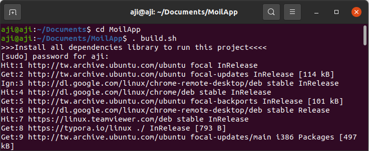

   Command line build environment project

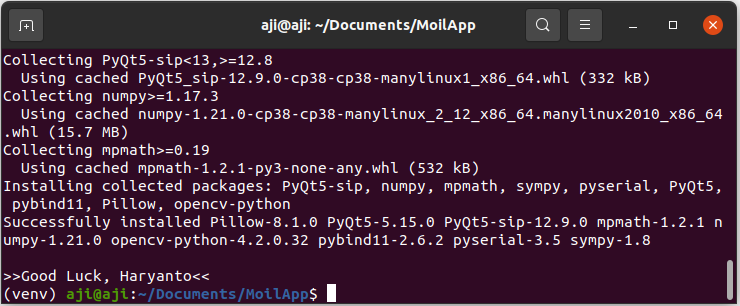

   message when you succeed build environment

c. Running MoilApp in terminal
-------------------------------

.. raw:: html

   

    You can easily run this project trough command line under virtual environment we build in previous section. Change directory to
    “src” then execute main.py using python like showing on picture bellow: 

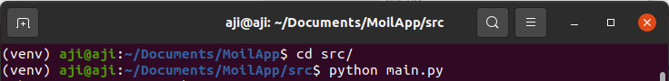

   Command line run MoilApp Project

.. raw:: html

   

    If everything works properly, you will get the main windows from MoilApp like shown below: 

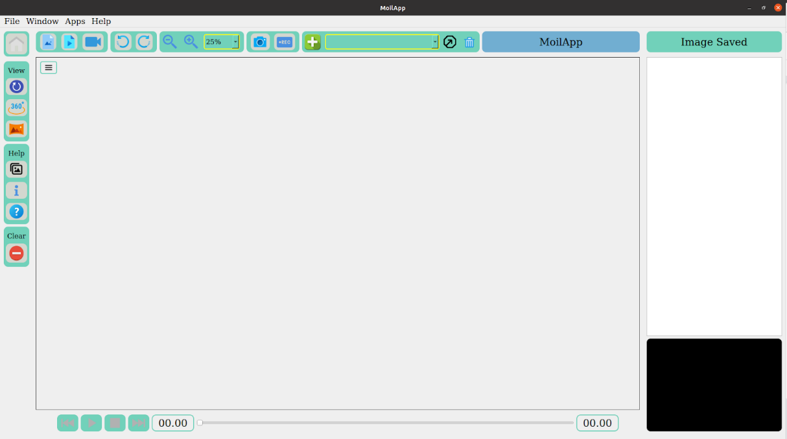

   Operations of the MoilApp

d. Setup project on PyCharm
----------------------------

.. raw:: html

   

    As I mentioned before, PyCharm is an integrated development environment (IDE) used in computer programming, specifically for the Python language.
    The IDE comprises code analysis tools, debugger, testing tools, and also version control options. It also assists developers in building Python plugins
    with the help of various APIs available. Some of the advantages that are the reason why PyCharm is recommended to use include Ease of use, Library integration
    and, autocomplete, Docs on the fly, Easy to view source code within a click, Suggestions like PEP8 correction, Possible error highlight right in the code,
    better way to write the same code, and more Fast development. If you don't have PyCharm installation on your computer, you can simply install using the command line: 

.. code-block:: bash

    $ sudo snap install pycharm-community –classic

.. raw:: html

   

    After successfully installed, open the PyCharm application and follow these steps to setup the MoilApp project:

e. Open project
---------------

.. raw:: html

   

    PyCharm displays the Welcome screen when no project is opened. For example, when you run PyCharm for the first time,
    or when you close the only open instance of a project. From this screen, you can create a new project, start you learning
    path with PyCharm Edu, import, open, or check out an existing project from version control. 

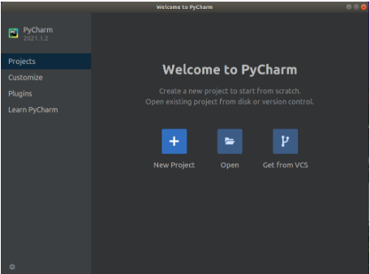

   Search MoilApp project

.. raw:: html

   

    Open the project by pressing the open button, then navigate to the MoilApp project directory. Like shown picture below: 

.. figure:: assets/10.Search_MoilApp_project.png
   :scale: 60 %
   :alt: alternate text
   :align: center

   PyCharm select interpreter

.. raw:: html

   

    Select MoilApp and click OK, the project will open in PyCharm as shown in the figure below: 

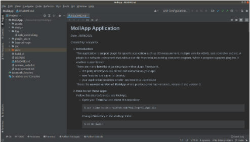

   Operations of the MoilApp

f. Select python interpreter
-----------------------------

.. raw:: html

   

    To work with your Python code in PyCharm, you need to configure at least one Python interpreter. You can use a system interpreter that
    is available with your Python installation. You can also create a Virtualenv, Pipenv, or Conda virtual environment. A virtual environment
    consists of a base interpreter and installed packages. When you configure a Python interpreter, you need to specify the path to the Python
    executable in your system. Here, we already create virtual environment [refer session 2.2-point b] in the same directory project, you just need
    to adding to the interpreter to PyCharm. 

- File >> settings… >> Project python interpreter

- Press Ctrl+Alt+S to open the project Settings/Preferences and go to Project <project name> | Python Interpreter

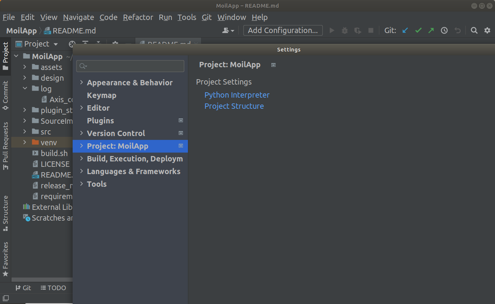

   PyCharm select interpreter

.. raw:: html

   

    Expand the list of the available interpreters and click the Show All link. Alternatively, click the + icon and select Show All. 

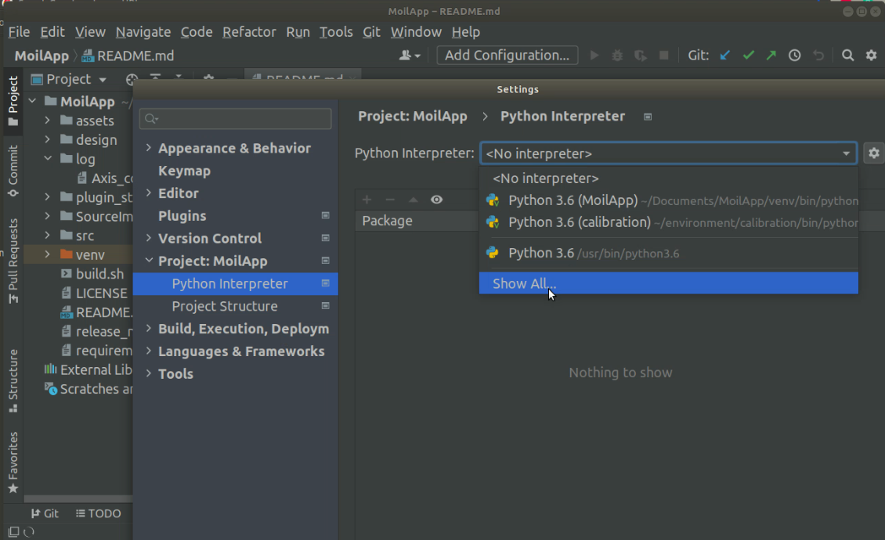

   Show all PyCharm interpreter available

.. raw:: html

   

    Add it by pressing the + button or click the icon then select add, select virtual environment, then select existing environment.
    browse the path to find the python interpreter. 

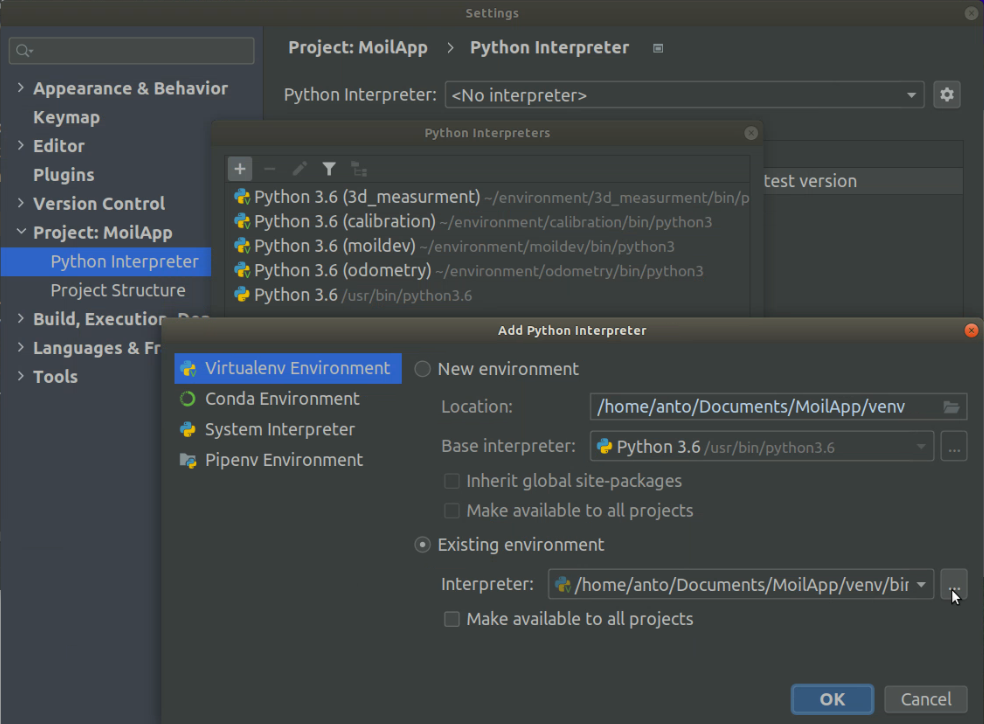

   Select existing python interpreter

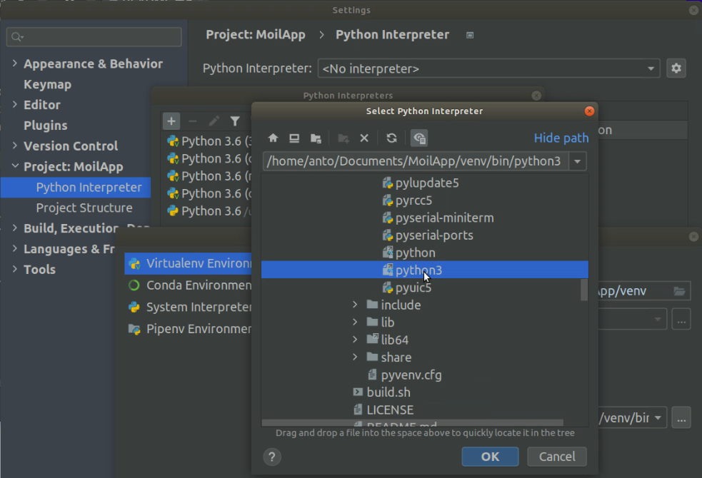

   Navigate to file interpreter

.. raw:: html

   

    Select python3 in the folder “MoilApp/venv/bin/”, then click OK to close all prompts.

g. Add configuration
----------------------

.. raw:: html

   

    You can add configuration by pressing the "add configuration" button then press the + sign select python. after that browse the mian.py
    in the “src” folder of the MoilApp project. as shown in the image below: 

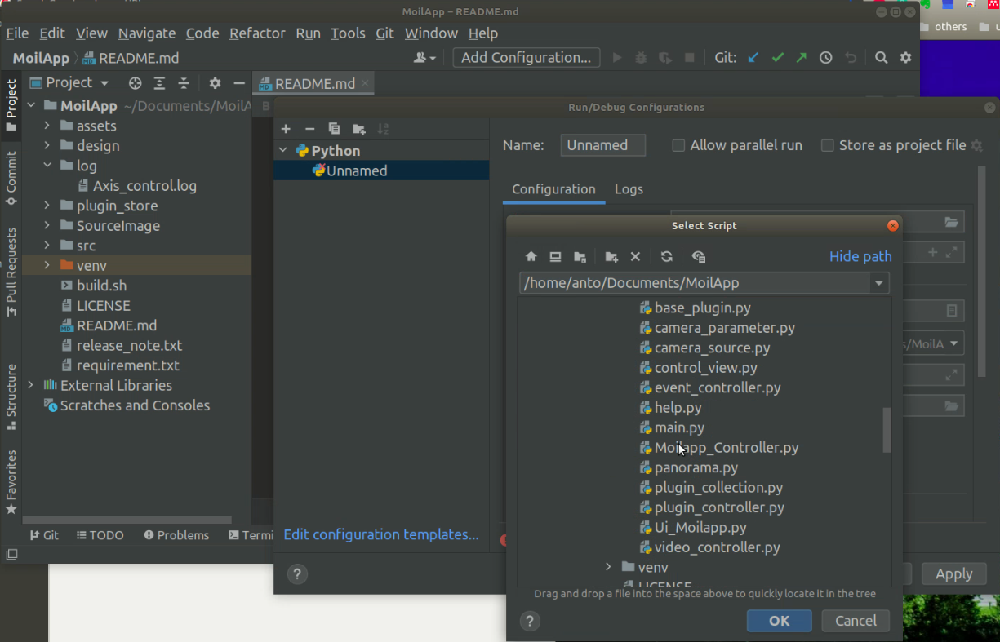

   Add configuration on PyCharm

h. Run project
---------------

.. raw:: html

   

    After you successfully doing all step, the you just click button run like bellow to run MoilApp project on PyCharm. 

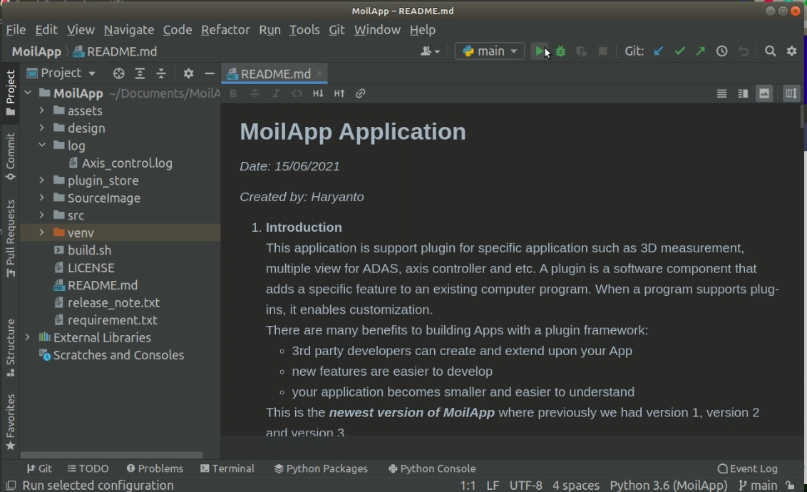

   Run MoilApp on PyCharm

.. figure:: assets/18.Overview_MoilApp_user_interface.png
   :scale: 60 %
   :alt: alternate text
   :align: center

   Overview MoilApp user interface

.. raw:: html

   

    If you have difficulty following this tutorial, then we have prepared a video that you can watch at the following link https://youtu.be/Hhf4sG6s_pA  

