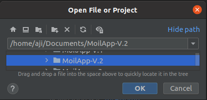
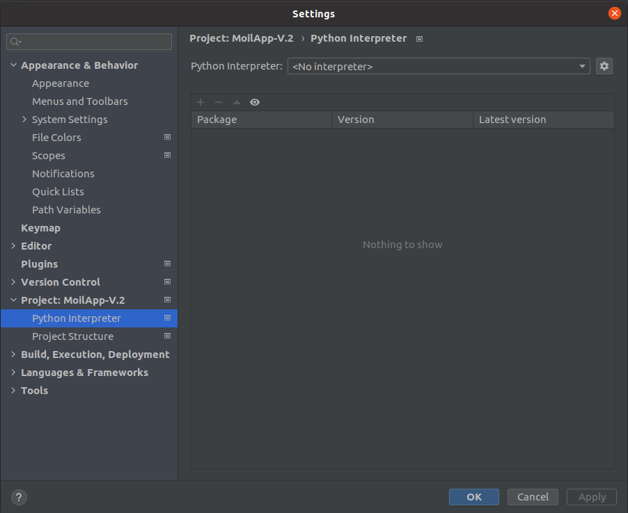
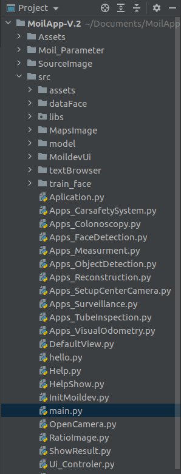
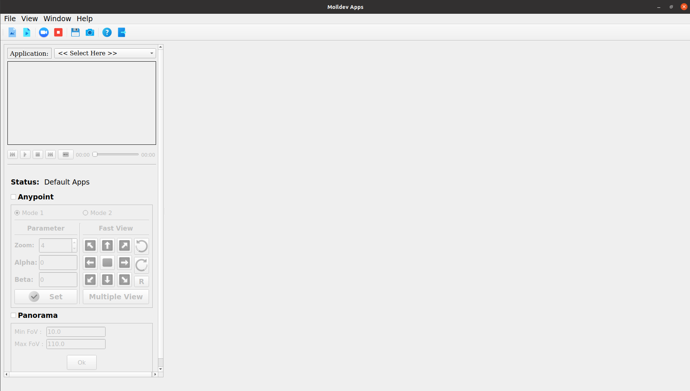

Installation MoilApp
####################

This guidance is tested on ubuntu 20.04, 22.04 with python version >3.8

1. How to run this App
======================

- Clone this repository to your computer

.. code-block:: bash

    $ git clone https://github.com/McutOIL/moilapp.git --branch=Moilapp-V2.0

- Open the directory

.. code-block:: bash

    $ cd moilapp

- Install the requirement following this command

.. code-block:: bash

    $ . build.sh

- Then run the code

.. code-block:: bash

    $ cd src

2. Set up using PyCharm IDE
===========================

.. raw:: html

   

    If you want to develop MoilApps then you can use the PyCharm IDE and follow this step. Make sure Point Number 2 above was successfully.

- If you don't have PyChram IDE, you can open your terminal and type this command

.. code-block:: bash

    $ sudo snap install pycharm-community --classic

- Open PyCharm then open your MoilApps Repository in your directory by using PyChram IDE

.. code-block:: bash

    File > Open > Select File Directory "MoilApps-V.2"

   Operations of the MoilApp

- Set Interpreter

.. code-block:: bash

    File > Settings... > Select "Project: MoilApps-V.2" > Python Interpreter

   Operations of the MoilApp

- Select Environment

.. code-block:: bash

    Select Add > Select Existing enverontment > Venv > bin > python3

   Operations of the MoilApp

3. Run Program using PyCharm IDE
=================================

-Open main.py program in folder src

.. code-block:: bash

    src folder > open main.py > right click on program > run

   Operations of the MoilApp

- Output program will be like this

   Operations of the MoilApp