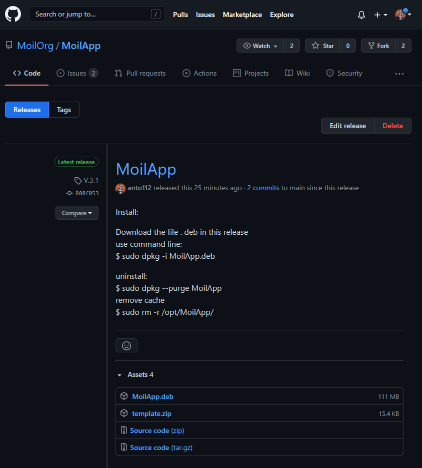

Debian package Distribution
###########################

.. raw:: html

   

    <b>Install using Debian package Distribution</b>

.. raw:: html

   

    The release of the MoilApp application is now available, you can easily download and install it on your computer without experiencing any difficulties.
    In the process of packaging this application, we use the fman build system (fbs) platform where It takes the source code and turns it into a standalone executable on Windows,
    Mac or Linux. On Linux OS, the standalone executable will be in the form of a file with a Debian package (.deb) extension. Debian packages are standard Unix ar archives that
    include two tar archives. One archive holds the control information and another contains the installable data. 

.. raw:: html

   

    You can find the MoilApp installer on the GitHub release at the following link: https://github.com/MoilOrg/MoilApp/releases/tag/V.3.1.  

   MoilApp Release

.. raw:: html

   

    <b>1. Installation guide:</b>

.. raw:: html

   

    Download the MoilApp.deb from release on GitHub, you can do it manually by visit the link or use command line from terminal in your Linux: 

.. raw:: html

   

    <b>2. Using wget</b>

.. code-block:: bash

    $ wget https://github.com/MoilOrg/MoilApp/releases/download/V.3.1/MoilApp.deb

.. raw:: html

   

    Using Curl

.. code-block:: bash

    $ curl -L https://github.com/MoilOrg/MoilApp/releases/download/V.3.1/MoilApp.deb > MoilApp.deb

.. raw:: html

   

    <b>2. There are two ways to install the application, that is:</b>

- Simply Right click on the .deb file, and choose Open With Software Install->Install.

- Alternatively, you can also install a .deb file by opening a terminal and typing:

.. code-block:: bash

    $ sudo dpkg -i MoilApp.deb

.. raw:: html

   

    <b>3. Uninstall the apps</b>

You can easly uninstall this app using command line:

.. code-block:: bash

    $ sudo dpkg --purge MoilApp

    Remove the cache

.. code-block:: bash

    $ sudo rm -r /opt/MoilApp

.. raw:: html

   

    <b>4. Reference</b>

C. Chuang-jan and Jan Gwo-Jen, “METHOD FOR PRESENTING FISHEYE-CAMERAMAGES,” US 7,042,508 B2, 2006.

- https://www.borrowlenses.com/blog/rectilinear-fisheye-wide-angle-lens/

- https://build-system.fman.io/pyqt5-tutorial

- https://zetcode.com/gui/pyqt5/

- https://www.tutorialspoint.com/pyqt5/index.htm

- https://betterprogramming.pub/speed-up-your-python-codebases-with-c-extensions-94859875eb70