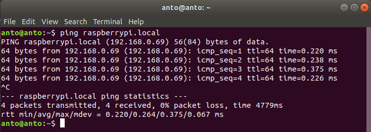
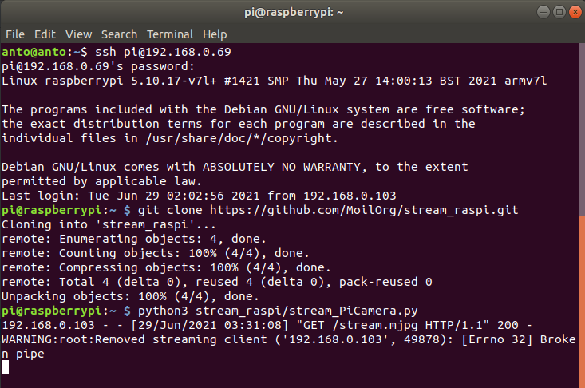
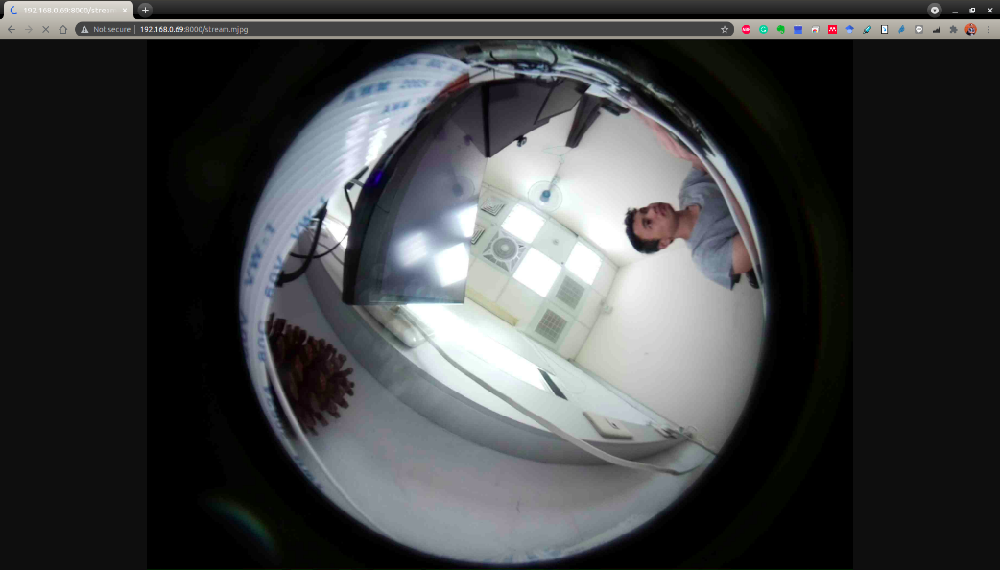
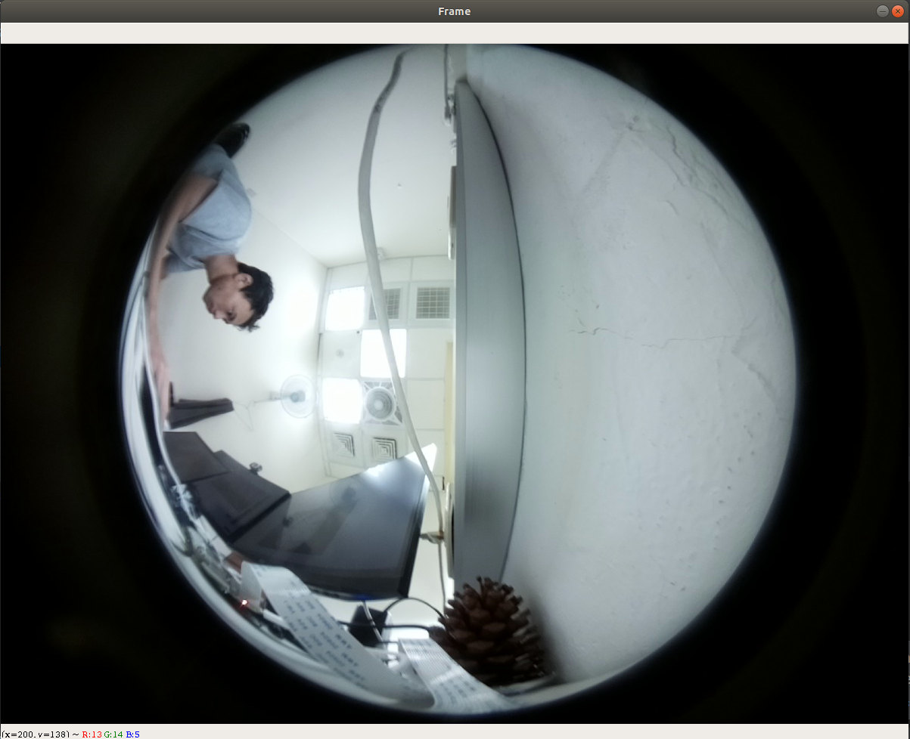

Setup streaming camera
#######################

3.1 Install OS in your raspberry-pi
===================================

.. raw:: html

   

    You can following this tutorial to installing operating system image in raspberry pi, visit here. Make sure you set the password when you install,
    its required when you want to access using SSH Client. 

3.2 Setup Connect to raspberry
==============================

.. raw:: html

   

    There are many ways to access raspberry, you can use desktop, PuTTY or via SSH client. Here will only explain in detail for the desktop and SSH client.
    if you are interested in using putty, you can read it on internet.

.. raw:: html

   

    The latest version of raspberry has been equipped with python installation version 3.7.3. To setup the raspberry as a camera stream, you just need to download
    the code from This link. Make sure you have enable the camera interface and SSH server, if not you can follow This tutorial. 

a. Desktop configuration
-------------------------

.. raw:: html

   

    Using the desktop to control a raspberry is almost the same as when you control your computer. When you want to activate camera streaming, you only need to download
    the code via terminal or directly via zip file from the link given. Then running the code using python3. 

.. raw:: html

   

    After that you only need to know the IP address of the raspberry that you use to access the streaming camera. You can use command line “ifconfig” to assign an address
    to a network interface or to configure or display the current network interface configuration information.  

b. SSH Client configuration
----------------------------

.. raw:: html

   

    If you use the same internet source, you can find the IP address of raspberry using the command line “ping raspberrypi.local” like shown below this: 

   Find raspberry-pi available

.. raw:: html

   

    If raspberry is detected, then the command line will show the IP address of the device like shown in picture above. This IP will later be used to access
    raspberry using the SSH Client. To connect, you just need to use the command line: 

.. code-block:: bash

     $ ssh username@Ip_adsress

.. raw:: html

   

    below is an example of a command line where the username is pi and the ip address is 192.168.0.69 so the SSH command line is "ssh pi@192.168.0.69".
    you just enter the password and it will be connected. 

.. figure:: assets/20.Connect_to_raspberry-pi_using_SSH_client.png
   :scale: 80 %
   :alt: alternate text
   :align: center

   Connect to raspberry-pi using SSH client

.. raw:: html

   

    After you are connected and can control the device from your computer's command line, you need to download the server code that I have provided on GitHub.
    Run the command line on terminal “ git clone https://github.com/MoilOrg/stream_raspi.git” like showing in below. After finish cloning the code, you just need
    to run using python3 and the streaming camera is active now. 

   Run server for streaming camera

3.3 Connect to the camera stream
================================

.. raw:: html

   

    After you run the code to enable streaming camera on the raspberry, you can access it via the link according to the IP address of the raspberry itself and add
    properties behind it. The camera streaming link format is “http://ip_address:8000/stream.mjpg”. You have to change the IP address according to the IP device you are using.
    You can open it directly from the browser or OpenCV. Some example shown in bellow this:

- Open camera streaming on browser

   Access streaming camera on web browser

.. code-block:: bash

     import cv2
     # Create a VideoCapture object and read from input file
     # If the input is the camera, pass 0 instead of the video file name
     cap = cv2.VideoCapture(“link_stream_cam”)
     # Check if camera opened successfully
     if (cap.isOpened()== False):
     print ("Error opening video stream or file")
     # Read until video is completed
     while(cap.isOpened()):
     # Capture frame-by-frame
     ret, frame = cap.read()
     if ret == True:
     # Display the resulting frame
     cv2.imshow('Frame',frame)
     # Press Q on keyboard to exit
     if cv2.waitKey(25) & 0xFF == ord('q'):
     break
     # Break the loop
     else:
     break
     # When everything done, release the video capture object
     cap.release()
     # Closes all the frames
     cv2.destroyAllWindows()

when you execute, you will get result like bellow this.

   Open streaming camera using OpenCV python