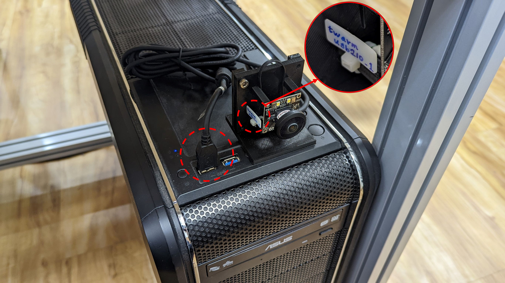

# moil_camera

**Python Module to access camera MOIL supported.**

## Part1. Requirement

### Tested:
- Ubuntu > 20.04
- Python > 3.8
- opencv-python > 4.5.3.56
```commandline
$ pip install opencv-python==4.5.3.56
```
## Part.2 Quick start
### Outline
- [2-1. Capture single frame](#2-1-capture-single-frame)
- [2-2. Video streaming](#2-2-video-streaming)
- [2-3. List supported camera type](#2-3-list-supported-camera-type)
- [2-4. Scan valid camera ID](#2-4-scan-valid-camera-id)
- [2-5. Valid camera resolution Info](#2-5-valid-camera-resolution-info)
- [2-6. Open / Close camera](#2-6-open--close-camera)
- [2-7. Resolution settings](#2-7-resolution-settings)
------
### [Before started](#outline)

- **Camera device:** <ins>Power on</ins> /  <ins>Connecting with your PC</ins>


- **Example of Camera : "Twarm-USB210"**



----

### [2-1. Capture single frame](#outline)
```python
from moil_camera import MoilCam

cam = MoilCam(cam_type='opencv_usb_cam', cam_id=0)

# Capture single frame
frame = cam.frame()

# Show image_cali
import cv2
cv2.imshow('frame', frame)
cv2.waitKey(0)
```
----

### [2-2. Video streaming](#outline)
```python
from moil_camera import MoilCam

cam = MoilCam(cam_type='opencv_usb_cam', cam_id=0)

# Show image_cali in while loop
import cv2
while True:
    frame = cam.frame()
    cv2.imshow('frame', frame)

    if cv2.waitKey(1) == ord('q'):
        break
```
----

### [2-3. List supported camera type](#outline)
**List camera type MOILCam supported:**

```python
from moil_camera import MoilCam

print(MoilCam.supported_cam_type())
```
**Output**
```python
['opencv_usb_cam', 'raspberry_pi4', ...( other camera type )]  # Other camera type under developing
```
----

### [2-4. Scan valid camera ID](#outline)

```python
from moil_camera import MoilCam

# USB Camera
print(MoilCam.scan_id(cam_type = 'opencv_usb_cam'))

# IP Camera
print(MoilCam.scan_id(cam_type = 'raspberry_pi4'))
```
**[ USB Camera ]**
```python
[0,2,...]
```
**[ IP Camera ]**
```python
['http://10.42.0.31:8000/stream.mjpg',
 'http://10.42.0.151:8000/stream.mjpg',
 'http://10.42.0.183:8000/stream.mjpg',...]
```
**[ Note ]**

If output is empty list **[ ]**, means "No Any Camera ID is detected". 

**[ Normal Warning ]** 
- When scan camera type is USB camera. 
- This module will try to connect to device port 0 ~ port 15.
- If port not connect any camera, following WARNING Massage will be shown.
```
[ WARN:0] global /tmp/pip-req-build-afu9cjzs/opencv/modules/videoio/src/cap_v4l.cpp (890) open VIDEOIO(V4L2:/dev/video1): can't open camera by index
```
----

### [2-5. Valid camera resolution Info](#outline)

```python
from moil_camera import MoilCam

print(MoilCam.valid_resolution(cam_type = 'opencv_usb_cam'))
```
```python
{
    'twarm_usb210': [(3264, 2448), 
                     (2592, 1944), 
                     (2048, 1536), 
                     (1920, 1080), 
                     (1600, 1200), 
                     (1280, 720), 
                     (800, 600), 
                     (640, 480)], 
    'endoscope_ometop': [(1920, 1080)],
    'endoscope_tioent': [(1920, 1080)],
 }
```
----

### [2-6. Open / Close camera](#outline)

```python
from moil_camera import MoilCam

# Auto open camera
cam = MoilCam(cam_type='opencv_usb_cam', cam_id=0)

# Close camera
cam.close()

# Open again
cam.open()
```
----

### [2-7. Resolution settings](#outline)

```python
from moil_camera import MoilCam

cam = MoilCam(cam_type='opencv_usb_cam', cam_id=0, resolution=(2592, 1944))

# Get current resolution
print(cam.get_resolution())
```
Output
```python
(2592, 1944)
```

```python
# Set current resolution
cam.set_resolution(resolution=(3264, 2448))

# Get current resolution
print(cam.get_resolution())
```
Output
```python
(3264, 2448)
```
